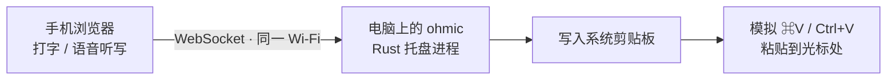

## 它是怎么工作的？

```mermaid
flowchart LR
  A["手机浏览器<br/>打字 / 语音听写"] -->|"WebSocket · 同一 Wi-Fi"| B["电脑上的 ohmic<br/>Rust 托盘进程"]
  B --> C["写入系统剪贴板"]
  C --> D["模拟 ⌘V / Ctrl+V<br/>粘贴到光标处"]
```

电脑端启动时会在本机打开一个二维码页面；手机扫码后打开输入页。两台设备需要在同一个 Wi-Fi 下，流量不离开局域网。

::: tip 自动粘贴需要系统权限
macOS 需要在「系统设置 → 隐私与安全性 → 辅助功能」里允许 ohmic；Windows 首次启动需要允许防火墙。没有权限时文字仍会写入剪贴板，手动按 ⌘/Ctrl+V 即可。
:::
